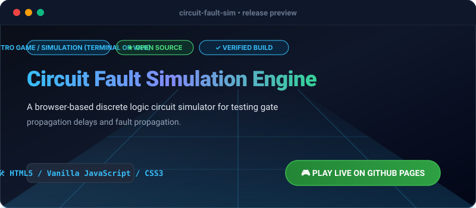

# Circuit Fault Simulation Engine

[](https://olamideakinade.github.io/circuit-fault-sim/)
[](https://github.com/Olamideakinade/circuit-fault-sim)
[](https://opensource.org/licenses/MIT)



> 🚀 **Live Demo Available:** Test and play this project live right now: **[https://olamideakinade.github.io/circuit-fault-sim/](https://olamideakinade.github.io/circuit-fault-sim/)**

`circuit-fault-sim` is a client-side discrete event simulation engine built for modeling combinational and sequential digital logic circuits. It provides an interactive canvas to construct logic nets using standard primitive gates (AND, OR, NOT, XOR, NAND, NOR) and trace signal propagation delays, race conditions, and stuck-at faults.

## Key Capabilities

- **Event-Driven Simulation:** Discrete event queue processes signal changes with configurable propagation delays per gate.
- **Fault Injection:** Supports stuck-at-0 (SA0) and stuck-at-1 (SA1) fault injection on any net to analyze propagation behavior.
- **Timing Diagrams:** Real-time visual timing graph rendering state transitions across selected probes.
- **Persistence:** Local serialization of circuit topologies using JSON schemas stored in `localStorage`.
- **Zero Dependencies:** Pure vanilla ES modules, CSS custom properties, and HTML5 Canvas API.

## Quickstart

Clone the repository and serve the root directory via any static file server:

```bash
git clone https://github.com/Olamideakinade/circuit-fault-sim.git
cd circuit-fault-sim
python3 -m http.server 8080
```

Open `http://localhost:8080` in your browser.

## Architecture

The application is partitioned into clean modular layers:

- `engine.js`: Core discrete event scheduler and gate netlist evaluator.
- `canvas.js`: High-performance rendering pipeline for wires, nodes, and bounding box hit-testing.
- `app.js`: Application state machine, UI binding, and simulation loop orchestration.
- `style.css`: Monochrome, high-contrast design system utilizing system-ui typography and CSS variables.

## License

MIT
